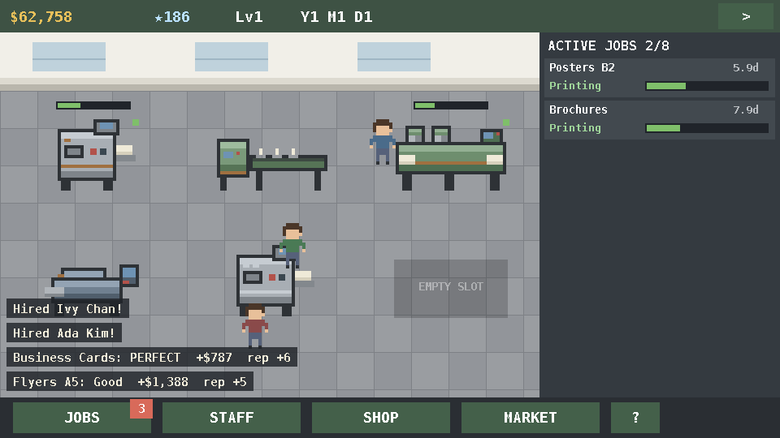

# PixelPress Tycoon

A Game Dev Story–style management sim for the **printing industry**, built as a
native Android game (pure Java, custom Canvas/SurfaceView engine, procedural
pixel-art sprites). Run a print shop: take contracts, assign presses and
operators, deliver on time and above the quality bar, and grow your reputation
to unlock bigger machines and new markets.



## Core loop

1. **JOBS** — clients offer print contracts (pay, sheet count, quality bar, deadline).
2. Accept a job, then tap it in the sidebar to assign a **press** and a **worker**.
3. The job runs through *Prepress → Printing → Finishing*; machines burn running
   costs per hour while they work.
4. Delivery is graded (Perfect / Good / Passable / Rejected) from machine
   quality + operator skill (+ CTP bonus for offset). Grades drive pay and
   **reputation**; reputation unlocks equipment tiers and new markets.
5. Wages and rent fall due monthly. Don't go broke.

## Systems

- **Equipment** (6 floor slots, 4 lines × 3 tiers): digital presses, offset
  presses (need plate setup — faster with a CTP), CTP platesetters (passive:
  cut offset setup, boost quality), finishing lines (required for jobs with a
  finishing level: cutting < fold/stitch < binding/die-cut).
- **Markets** with seasonal demand curves and reputation gates: Commercial →
  Publishing (150★) → Packaging (400★) → Labels (800★). Demand shifts pay and
  offer frequency each month.
- **Workers**: four skills (offset press, digital, prepress, finishing), levels
  and promotion titles (Trainee → … → Print Legend), XP from working, paid
  training per discipline, monthly hiring pool.
- **Persistence**: auto-saves (SharedPreferences JSON) on change and on exit.

## Building the APK

No Android Studio or Google SDK needed — the toolchain is Debian/Ubuntu
packages plus one jar:

```bash
sudo apt install aapt zipalign apksigner dalvik-exchange openjdk-21-jdk-headless
./build.sh          # fetches sdk/android-34.jar on first run
```

Pipeline: `aapt` (resources + R.java) → `javac` (against android-34.jar) →
`dx` (dex) → `aapt add` → `zipalign` → `apksigner` (v1+v2, debug-grade key in
`release.keystore`, password `pixelpress`).

Output: **`build/PixelPressTycoon.apk`** — signed and side-loadable on
Android 5.0+ (min SDK 21, target SDK 34). A prebuilt copy is committed at
`dist/PixelPressTycoon.apk`.

### Install

```bash
adb install dist/PixelPressTycoon.apk
```

or copy the APK to the phone and open it (enable "install unknown apps").

## Project structure

```
app/src/main/AndroidManifest.xml
app/src/main/res/                      # launcher icon (generated), strings
app/src/main/java/com/pixelpress/tycoon/
  MainActivity.java   # fullscreen landscape host
  GameView.java       # SurfaceView render loop, 960x540 virtual canvas, input
  Game.java           # simulation: time, economy, jobs, quality, unlocks
  Catalog.java        # static data: machines, markets, job templates
  Machine.java / Worker.java / Job.java
  Sprites.java        # procedural pixel-art sprite factory
  Ui.java             # shop-floor scene, HUD, panels, immediate-mode buttons
  SaveGame.java       # JSON save/load
build.sh              # SDK-less APK pipeline
tools/                # icon generator, arsc repack helper
```

The simulation core (`Game`, `Catalog`, `Worker`, `Job`, `Machine`) has no
Android dependencies and can be exercised headless on the JVM.
